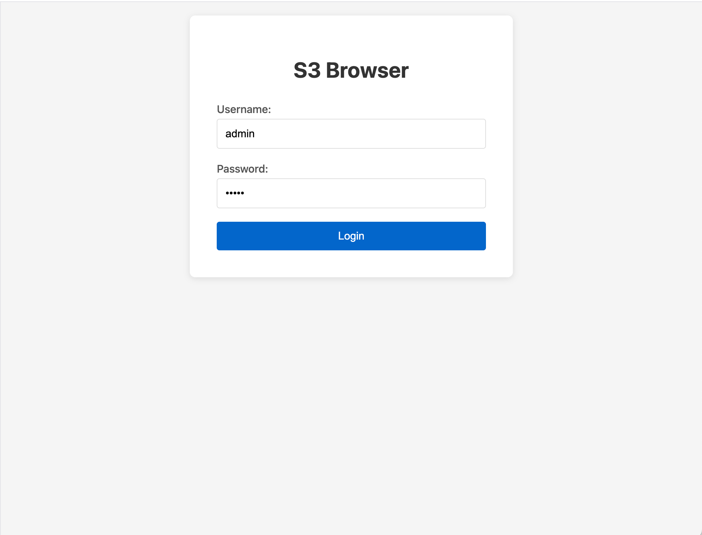
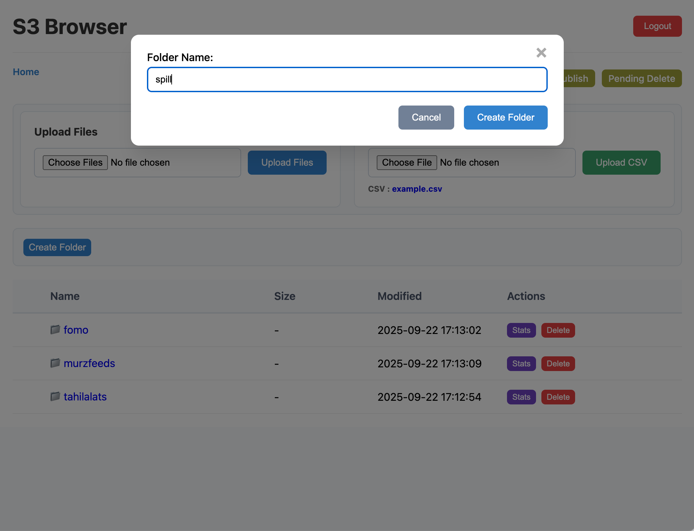
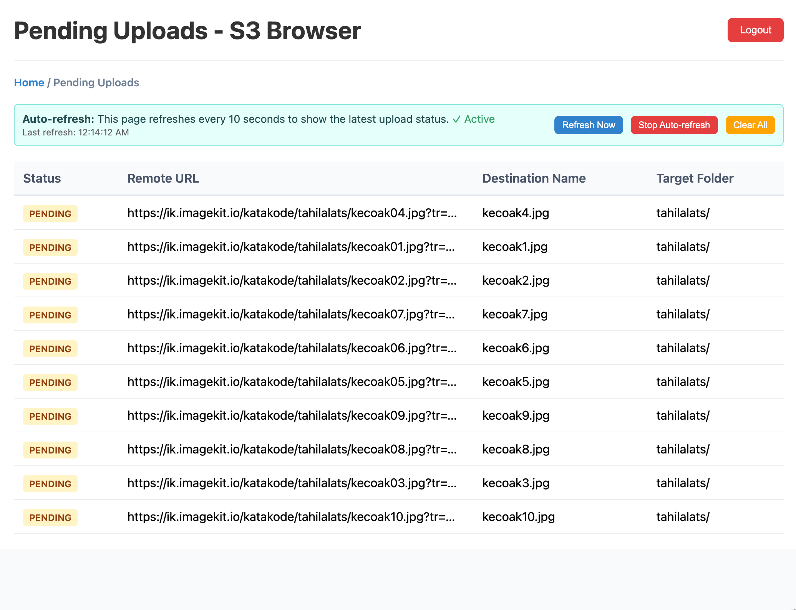
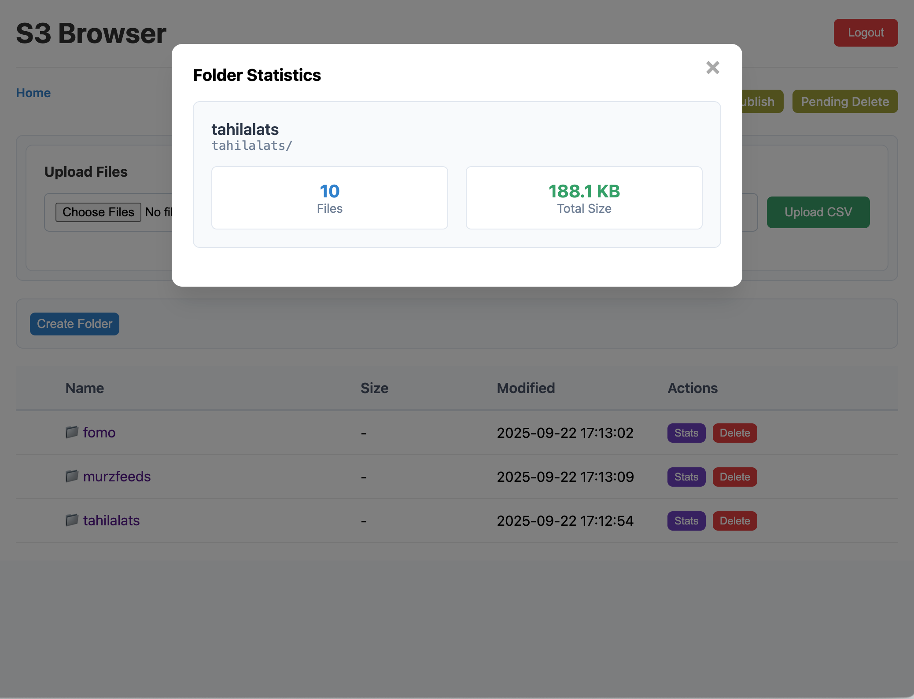
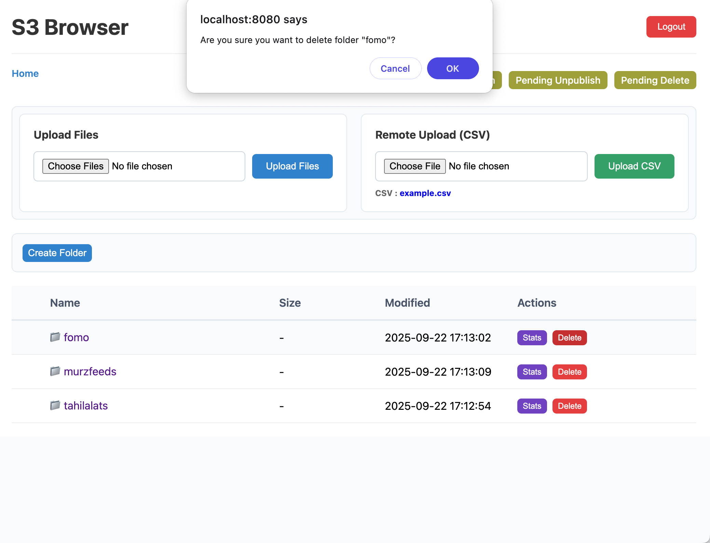
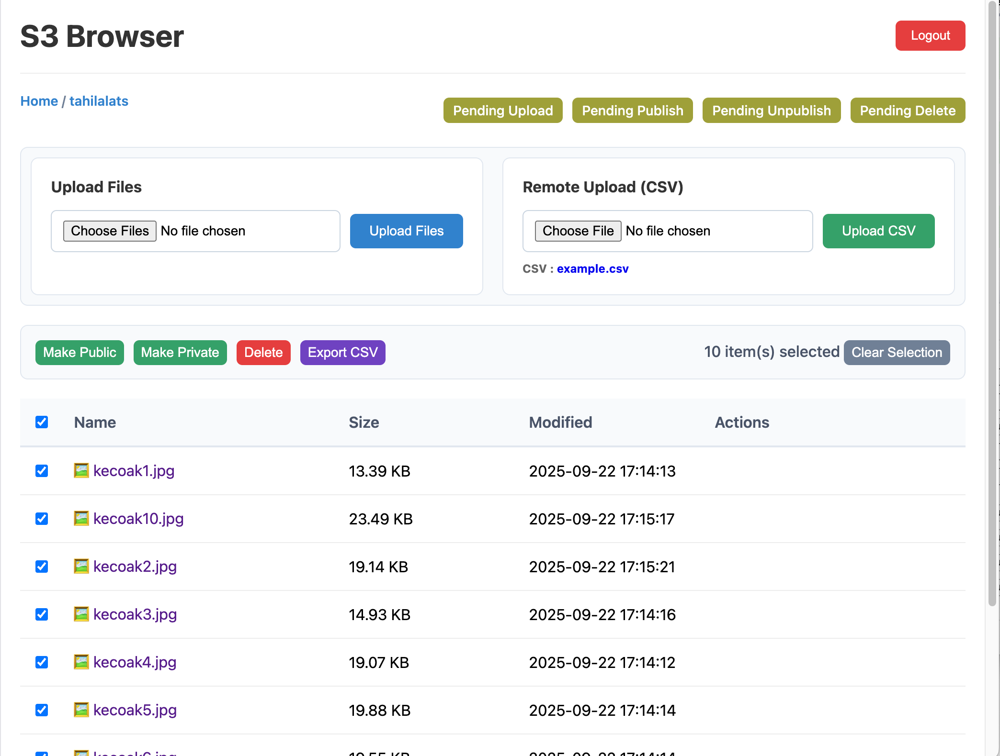
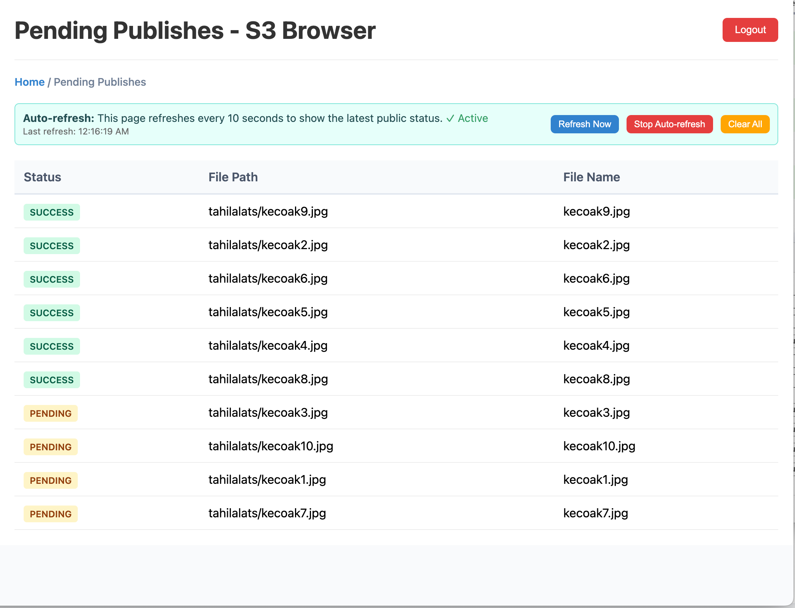
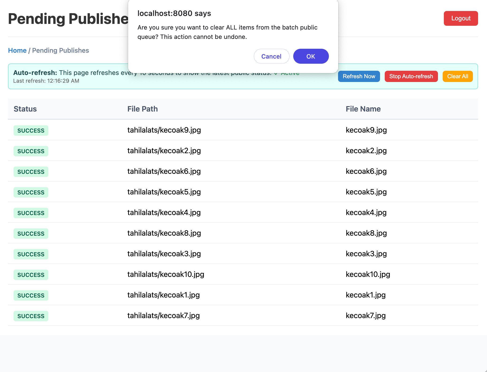
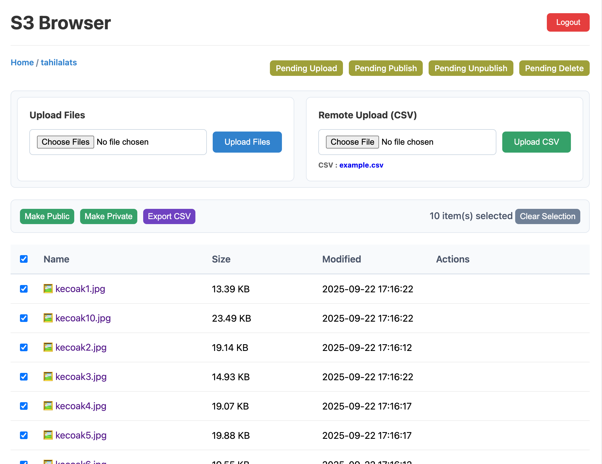

# S3 Browser

A simple web app for browsing S3 buckets, kinda like FileZilla but in your browser. Built with Go and works with DigitalOcean Spaces, and should be work with other s3-compatible provider like AWS S3, Cloudflare R2, etc.

## What it does

### Feature wise

- Browse files and folders in your S3 bucket through a web interface
- Two user types: admins can do everything, regular users can't create/delete folders/files, but can upload files
- Upload one by one, or multiple upload from computer
- Upload remote files via csv upload that handled asynchronously (via queue)
- Preview file on s3 without publishing it
- Create and manage folders (admin only)
- Batch operations for multiple files at once that happened asynchronously (via queue) so it wont need persistence http connection, hit and forget (and wait later)
- Shows folder stats and file counts
- Make file public (publish) or make it private (unpublish), by default the file uploaded are all private
- Safe to be used with non tech savy person

### Technology wise

- Use simple UI in `/ui`
- Use simple js without build or webpack, changing the css,js, or html codes does not need server for restart or rebuild
- Use simple in-memory db but with persistence via bbolt, no need extra external mysql/postgres
- Small foot print (on my machine it took less than 50MB on docker)

## User types

### Admin
- Can do pretty much everything
- Create and delete folders
- Run batch operations on files
- Manage the upload queue
- See all the admin stuff

This user preferable being used just for setting up the structure (folders), just like 'root' in linux, you can use it but better safe (use normal user) than sorry

### Regular user
- Can do all except, create/delete folder, also cannot delete file.

The purpose behind this user is to make old people or person that has difficulty with tech, safe to use this browser and avoid accidental removal of folder, this is dangerous since removing folder also removing all contents inside it.

For safety, the backend validates authentication token (jwt) as well, even if the user able to show the button, the backend will do another check.

## Screenshots

### Login


### Create Folder (Admin Only)


### Remote Upload Pending Page


### Folder Statistics


### Delete Folder (Admin Only)


### Batch Operations


### Batch Publish Pending Page


### Clear Pending Queue


### Non-Admin UI


Non admin (user) cannot delete file or folder, also the "Create Folder" action is hidden

## Getting started

### Prerequisite

You need valid s3 api keys and secret to make it work. 
For DigitalOcean, you could use DigitalOcean space https://www.digitalocean.com/products/spaces


### With Docker (easiest)

1. Get the code:
```bash
git clone <repository-url>
cd s3browser
```

2. Copy the config file:
```bash
cp config.yml.example config.yml
```

3. Edit `config.yml` with your S3 details:
```yaml
s3:
  access_key: "your-digitalocean-spaces-access-key"
  secret_key: "your-digitalocean-spaces-secret-key"
  region: "sgp1"
  endpoint: "https://sgp1.digitaloceanspaces.com"
  bucket: "your-bucket-name"

jwt:
  secret: "your-jwt-secret"

users:
  - username: "admin"
    role: "admin"
    password: "your-secure-password"
  - username: "user"
    role: "user"
    password: "super-strong-password"
```

4. Run it:
```bash
docker-compose up -d
```

or via Makefile 
```bash
make docker-run
```

4.1 Docker stuff
```bash
make docker-logs
```
to see logs.

To make it stop:
```bash
make docker-stop
```

5. Open `http://localhost:8080` in your browser
You can change the port via `docker-compose.yml` port mapping.

### Build from source

1. Make sure you have Go 1.24+ installed
2. Get the dependencies:
```bash
go mod download
```

3. Build it:
```bash
go build -o s3browser ./cmd/.
```

4. Run it:
```bash
./s3browser
```

## Config

The app uses a YAML config file with these sections:

- **s3**: Your S3 storage settings
- **jwt**: Authentication secret
- **queue**: Background job settings
- **users**: Login accounts and roles

## License

MIT License - do whatever you want with it, Frankly, I don't even know what that means.
